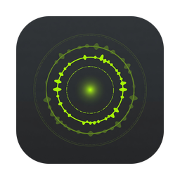

  

<h1 align="center">VoiceApp</h1>

<strong>Hold a key. Speak. Your words appear — in any app.</strong>

  <a href="https://github.com/DistinctZA/voiceapp-releases/releases/latest">⬇ Download for macOS</a>
  &nbsp;·&nbsp;
  <a href="https://voice-app.xyz/">Website</a>

---

VoiceApp is a push-to-talk dictation app for macOS. Hold your hotkey, talk, release — and the transcribed text is typed straight into whatever app you're using: your editor, browser, chat, terminal, anywhere.

## Local or cloud — your choice

**🔒 Runs 100% locally.** On-device speech models (NVIDIA Parakeet, OpenAI Whisper) accelerated with Apple Metal. No account, no subscription, no audio ever leaving your Mac. Works on a plane.

**⚡ Or bring your own AI.** Flip one switch and transcribe through Grok (xAI), OpenAI, or any model on OpenRouter using **your own API key** — frontier-model accuracy for fractions of a cent per dictation, billed to your account, not ours.

Switch between them any time. The app shows you exactly which engine is listening.

## Highlights

- **Push-to-talk** — bind any key (even just ⌃) and dictate hold-to-talk or hands-free
- **Types into every app** — not a text box you copy from; the words land where your cursor is
- **Live voice pulse** — an on-screen trace shows your voice being heard, centered and glowing
- **Custom vocabulary** — teach it names and jargon it should recognize
- **History with audio** — every dictation kept locally, re-transcribable
- **Auto-updates** — installs from here, updates itself with signed releases

## Install

1. Download the latest `VoiceApp_x.x.x_aarch64.dmg` from [Releases](https://github.com/DistinctZA/voiceapp-releases/releases/latest)
2. Drag **VoiceApp** to Applications and open it (right-click → Open the first time)
3. Grant Microphone and Accessibility when asked — then hold your hotkey and talk

Requires macOS on Apple Silicon.

---

This repository hosts VoiceApp's releases and update feed. The "Source code" links GitHub attaches to releases contain only this README — VoiceApp itself is closed-source, © DistinctZA.
